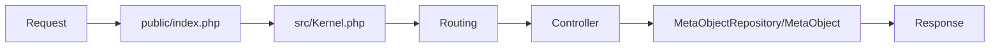

# System Architecture Overview

## 1. Introduction

BareAPI is a Symfony-based backend that exposes dynamic CRUD endpoints for arbitrary object types defined by JSON Schema files (`config/schemas/`). It uses a single generic Doctrine entity and runtime schema validation to handle all types uniformly, minimizing boilerplate and maximizing flexibility.

## 2. Architectural Patterns

The application follows the Model-View-Controller (MVC) pattern and a layered architecture for separation of concerns, modularity, and scalability.

## 3. Core Components

- **Kernel:** Bootstraps the app. See [`src/Kernel.php`](src/Kernel.php:1).
- **Controllers:** Handle HTTP requests for CRUD operations. See [`src/Controller/`](src/Controller/).
- **Entity:** All data is stored in a single table via [`MetaObject.php`](src/Entity/MetaObject.php:1).
- **Repository:** Data persistence and querying logic in [`MetaObjectRepository.php`](src/Repository/MetaObjectRepository.php:1).
- **JSON Schemas:** Define object types and validation rules in [`config/schemas/`](config/schemas/).
- **Routing:** Dynamic routes declared in [`config/routes/data.yaml`](config/routes/data.yaml:1).
- **Configuration:** Service wiring and autoloading in [`config/services.yaml`](config/services.yaml:1) and [`composer.json`](composer.json:1).

## 4. Data Flow

## 5. Directory Structure

- **src/Controller:** Invokable controllers for each CRUD operation and root endpoint.
- **src/Entity:** Contains the `MetaObject` entity.
- **src/Repository:** Contains the `MetaObjectRepository`.
- **config/schemas:** JSON Schema files for each object type.
- **config/routes:** Route definitions, especially `data.yaml` for dynamic endpoints.
- **public:** Web entry point (`index.php`).
- **tests:** Unit and functional tests for controllers and features.
- **docs:** Project documentation.

## 6. CRUD Agents (Controllers)

Each CRUD operation is handled by a dedicated controller:
- [`DataCreateController`](src/Controller/DataCreateController.php:1): `POST /data/{type}`
- [`DataDeleteController`](src/Controller/DataDeleteController.php:1): `DELETE /data/{type}/{id}`
- [`DataListController`](src/Controller/DataListController.php:1): `GET /data/{type}`
- [`DataShowController`](src/Controller/DataShowController.php:1): `GET /data/{type}/{id}`
- [`DataUpdateController`](src/Controller/DataUpdateController.php:1): `PUT /data/{type}/{id}`
- [`HomeController`](src/Controller/HomeController.php:1): `/` root endpoint

Controllers use the repository and validate data against the relevant JSON Schema before persistence.

## 7. Dynamic Routing

Routes are declared once in `config/routes/data.yaml` using wildcards. Adding a new schema file immediately exposes new endpoints.

## 8. Validation Pipeline

Controllers load the relevant JSON Schema and validate incoming data using `justinrainbow/json-schema` and Symfony Validator. Only schema-compliant data is persisted.

## 9. How to Add a New Object Type

1. Add a JSON Schema to `config/schemas/{newtype}.json`.
2. (Optionally) define a `version` in your schema.
3. Use the REST endpoints `/data/{newtype}` and `/data/{newtype}/{id}`—no code changes required.

## 10. Dependencies

- PHP 8.3+
- Symfony Framework + Flex
- Doctrine ORM + Migrations + DBAL (PostgreSQL)
- symfony/validator, justinrainbow/json-schema
- ramsey/uuid

---

End of the architecture overview document.
