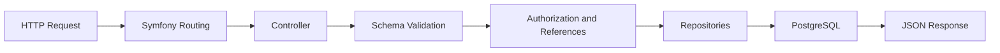

# Architecture Overview

BareAPI is a Symfony-based semantic and versioned document store. It keeps the original schema-driven CRUD model, but the v1 API stores schemas, metadata, revisions, references, and authorization metadata in product-neutral structures.

## Core Tables

- `schemas`: versioned JSON Schemas by `object_type` and `version`, with one default version per object type.
- `meta_objects`: object metadata such as UUID, object type, schema version, branch, name, timestamps, and soft-delete marker.
- `meta_object_revisions`: immutable revision payloads for each object UUID.
- `meta_refs`: generic object references extracted from schema-declared reference paths.

The older `type` and `data` fields remain for compatibility with the legacy `/api/{type}` endpoints.

## Request Flow

```mermaid
graph LR
    A[HTTP Request] --> B[Symfony Routing]
    B --> C[Controller]
    C --> D[Schema Validation]
    D --> E[Authorization and References]
    E --> F[Repositories]
    F --> G[PostgreSQL]
    G --> H[JSON Response]
```

## v1 Controllers

- `RepositoryCreateController`: `POST /api/v1/repository/{objectType}`
- `RepositoryListController`: `GET /api/v1/repository/{objectType}`
- `RepositoryObjectController`: object read, update, delete, revision read, and revision delete routes.
- `SchemaController`: schema read routes.
- `HealthController`: `/health-check`
- `DocumentationController`: `/api/v1/documentation/openapi.json`
- `HomeController`: service index and route overview.

## Services

- `SchemaValidatorService`: validates payloads against JSON Schema files for legacy compatibility.
- `SchemaRepository`: stores and reads versioned schemas from PostgreSQL.
- `JsonApiResponseFactory`: builds JSON:API-style resource envelopes.
- `AuthorizationService`: enforces optional `x-bareapi.acl` permissions for writes.
- `FilterParser`: parses raw query strings so dotted JSON paths are preserved.
- `ReferenceIntegrityService`: extracts references, validates targets, and applies restrict/cascade delete rules.

## Compatibility

The legacy `/api/{type}` routes are intentionally preserved. They remain useful for existing clients and for file-schema-only workflows. New document-store capabilities are exposed under `/api/v1`.

No Organization, Project, or admin-specific concepts are part of this implementation.
